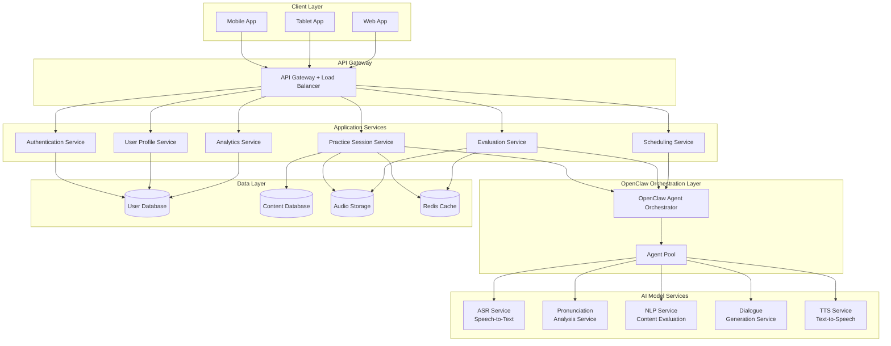
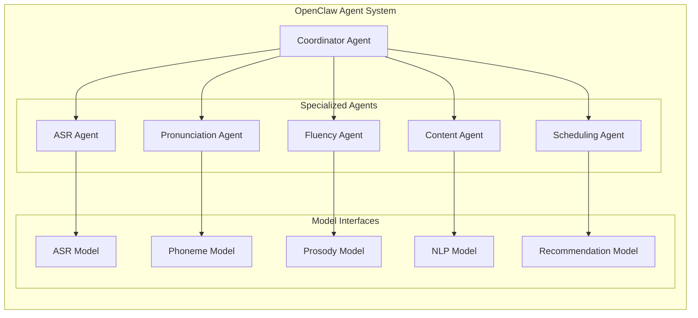
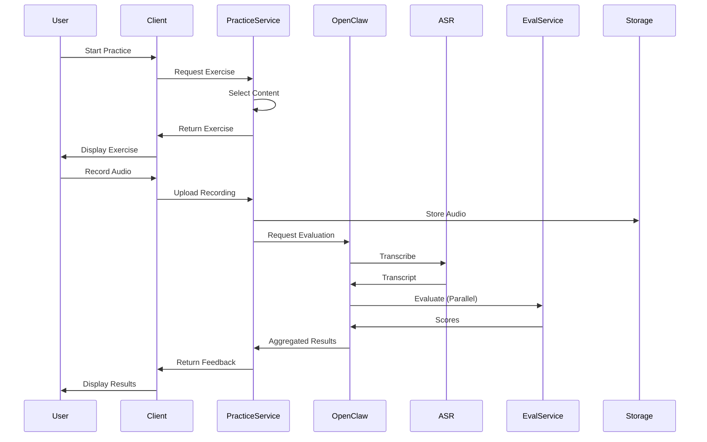

# Design Document: Tingwu Zhongkao AI Listening-Speaking Training System

## Overview

The Tingwu Zhongkao AI Listening-Speaking Training System is an intelligent English learning platform that leverages multi-AI model collaboration through the OpenClaw architecture to provide personalized, exam-aligned training for Chinese middle school students preparing for the Zhongkao English listening and speaking exam.

### Core Design Principles

1. **Exam Alignment**: All content, evaluation criteria, and scoring mechanisms strictly follow official Zhongkao exam standards
2. **Personalization**: Adaptive learning paths driven by continuous assessment and error pattern analysis
3. **Multi-Model Orchestration**: Specialized AI models coordinated through OpenClaw for comprehensive evaluation
4. **Cross-Platform Consistency**: Unified experience across mobile, tablet, and PC with device-appropriate optimizations
5. **Real-Time Feedback**: Immediate, actionable feedback to accelerate learning cycles

### Key Technical Challenges

1. **Speech Recognition Accuracy**: Chinese learners' English has unique phonetic patterns requiring specialized ASR models
2. **Real-Time Dialogue Generation**: Maintaining context and naturalness in role-play scenarios while ensuring low latency
3. **Multi-Dimensional Evaluation**: Coordinating multiple AI models to provide holistic assessment across pronunciation, fluency, intonation, and content
4. **Scalability**: Handling peak loads during exam seasons and after-school hours
5. **Offline Capability**: Supporting practice in environments with limited connectivity

## Architecture

### High-Level Architecture

The system follows a microservices architecture with OpenClaw serving as the orchestration layer for AI model collaboration.



### OpenClaw Integration Architecture

OpenClaw serves as the intelligent orchestration layer that coordinates multiple specialized AI models to deliver comprehensive evaluation and adaptive learning experiences.



**OpenClaw Agent Responsibilities:**

- **Coordinator Agent**: Orchestrates evaluation workflow, aggregates results from specialized agents, manages agent lifecycle
- **ASR Agent**: Transcribes speech to text, handles audio preprocessing, manages ASR model inference
- **Pronunciation Agent**: Analyzes phoneme-level accuracy, identifies specific pronunciation errors, compares against native speaker patterns
- **Fluency Agent**: Measures speech rate, analyzes pause patterns, detects hesitations and fillers
- **Content Agent**: Evaluates semantic correctness, checks information completeness, assesses grammatical accuracy
- **Scheduling Agent**: Analyzes performance patterns, generates personalized practice schedules, adapts to user progress

### Component Architecture

#### Practice Session Flow



## Components and Interfaces

### 1. Authentication Service

**Responsibilities:**
- User registration and login
- Session management
- Token generation and validation
- Password encryption and recovery

**API Endpoints:**
```
POST /api/v1/auth/register
POST /api/v1/auth/login
POST /api/v1/auth/logout
POST /api/v1/auth/refresh-token
POST /api/v1/auth/reset-password
```

**Key Interfaces:**
```typescript
interface RegisterRequest {
  username: string;
  password: string;
  email: string;
  grade: number;
  school: string;
  targetExamDate: Date;
}

interface AuthResponse {
  accessToken: string;
  refreshToken: string;
  userId: string;
  expiresIn: number;
}
```

### 2. User Profile Service

**Responsibilities:**
- User profile management
- Baseline assessment coordination
- Learning path generation
- Progress tracking

**API Endpoints:**
```
GET /api/v1/users/{userId}/profile
PUT /api/v1/users/{userId}/profile
POST /api/v1/users/{userId}/baseline-assessment
GET /api/v1/users/{userId}/learning-path
GET /api/v1/users/{userId}/progress
```

**Key Interfaces:**
```typescript
interface UserProfile {
  userId: string;
  name: string;
  grade: number;
  school: string;
  targetExamDate: Date;
  baselineLevel: ProficiencyLevel;
  currentLevel: ProficiencyLevel;
  learningPath: LearningPath;
  createdAt: Date;
  updatedAt: Date;
}

interface ProficiencyLevel {
  overall: number; // 0-100
  pronunciation: number;
  fluency: number;
  intonation: number;
  comprehension: number;
}

interface LearningPath {
  pathId: string;
  userId: string;
  milestones: Milestone[];
  currentMilestone: number;
  estimatedCompletionDate: Date;
}
```

### 3. Practice Session Service

**Responsibilities:**
- Exercise content delivery
- Session state management
- Audio recording coordination
- Practice history tracking

**API Endpoints:**
```
POST /api/v1/practice/sessions
GET /api/v1/practice/sessions/{sessionId}
POST /api/v1/practice/sessions/{sessionId}/submit
GET /api/v1/practice/exercises
GET /api/v1/practice/history
```

**Key Interfaces:**
```typescript
interface PracticeSession {
  sessionId: string;
  userId: string;
  exerciseType: ExerciseType;
  exercise: Exercise;
  startTime: Date;
  endTime?: Date;
  status: SessionStatus;
  recording?: AudioRecording;
  evaluation?: EvaluationResult;
}

enum ExerciseType {
  READING_ALOUD = 'reading_aloud',
  SITUATIONAL_QA = 'situational_qa',
  INFORMATION_RETELLING = 'information_retelling',
  ROLE_PLAY = 'role_play'
}

interface Exercise {
  exerciseId: string;
  type: ExerciseType;
  content: ExerciseContent;
  difficulty: number;
  timeLimit: number;
  preparationTime: number;
}

interface AudioRecording {
  recordingId: string;
  url: string;
  duration: number;
  format: string;
  sampleRate: number;
  uploadedAt: Date;
}
```

### 4. Evaluation Service

**Responsibilities:**
- Coordinate OpenClaw evaluation workflow
- Aggregate multi-dimensional scores
- Generate detailed feedback
- Identify error patterns

**API Endpoints:**
```
POST /api/v1/evaluation/evaluate
GET /api/v1/evaluation/results/{evaluationId}
GET /api/v1/evaluation/feedback/{evaluationId}
POST /api/v1/evaluation/compare
```

**Key Interfaces:**
```typescript
interface EvaluationRequest {
  sessionId: string;
  exerciseType: ExerciseType;
  recordingId: string;
  referenceContent?: string;
}

interface EvaluationResult {
  evaluationId: string;
  sessionId: string;
  overallScore: number;
  dimensions: DimensionScores;
  transcript: string;
  errors: Error[];
  feedback: Feedback;
  evaluatedAt: Date;
}

interface DimensionScores {
  pronunciation: DimensionScore;
  fluency: DimensionScore;
  intonation: DimensionScore;
  completeness: DimensionScore;
}

interface DimensionScore {
  score: number; // 0-100
  details: ScoreDetail[];
  suggestions: string[];
}

interface Error {
  errorId: string;
  type: ErrorType;
  category: ErrorCategory;
  location: ErrorLocation;
  description: string;
  correction: string;
  severity: number;
}

enum ErrorType {
  PRONUNCIATION = 'pronunciation',
  GRAMMAR = 'grammar',
  VOCABULARY = 'vocabulary',
  FLUENCY = 'fluency',
  CONTENT = 'content'
}
```

### 5. Scheduling Service

**Responsibilities:**
- Generate personalized practice schedules
- Adapt to user performance
- Balance question type distribution
- Manage mock exam scheduling

**API Endpoints:**
```
GET /api/v1/schedule/recommendations
POST /api/v1/schedule/generate
PUT /api/v1/schedule/adjust
GET /api/v1/schedule/upcoming
```

**Key Interfaces:**
```typescript
interface ScheduleRecommendation {
  userId: string;
  recommendations: PracticeRecommendation[];
  generatedAt: Date;
  validUntil: Date;
}

interface PracticeRecommendation {
  recommendationId: string;
  exerciseType: ExerciseType;
  difficulty: number;
  priority: number;
  reason: string;
  estimatedDuration: number;
  suggestedTime?: Date;
}
```

### 6. Analytics Service

**Responsibilities:**
- Progress tracking and visualization
- Performance trend analysis
- Report generation
- Comparative analytics

**API Endpoints:**
```
GET /api/v1/analytics/dashboard/{userId}
GET /api/v1/analytics/progress/{userId}
GET /api/v1/analytics/reports/{userId}
GET /api/v1/analytics/trends/{userId}
```

**Key Interfaces:**
```typescript
interface AnalyticsDashboard {
  userId: string;
  summary: PerformanceSummary;
  recentActivity: Activity[];
  skillBreakdown: SkillAnalysis;
  progressTrend: TrendData[];
  upcomingMilestones: Milestone[];
}

interface PerformanceSummary {
  totalPracticeSessions: number;
  totalPracticeTime: number; // minutes
  averageScore: number;
  improvementRate: number; // percentage
  streakDays: number;
  completionRate: number;
}

interface SkillAnalysis {
  pronunciation: SkillMetrics;
  fluency: SkillMetrics;
  intonation: SkillMetrics;
  comprehension: SkillMetrics;
}

interface SkillMetrics {
  currentLevel: number;
  baselineLevel: number;
  improvement: number;
  weakAreas: string[];
  strongAreas: string[];
}
```

### 7. OpenClaw Orchestrator Service

**Responsibilities:**
- Agent lifecycle management
- Model coordination
- Result aggregation
- Performance optimization

**Internal Interfaces:**
```typescript
interface OrchestrationRequest {
  requestId: string;
  taskType: TaskType;
  input: TaskInput;
  priority: number;
  timeout: number;
}

interface OrchestrationResult {
  requestId: string;
  results: AgentResult[];
  aggregatedScore: AggregatedScore;
  executionTime: number;
  agentsUsed: string[];
}

interface AgentResult {
  agentId: string;
  agentType: string;
  output: any;
  confidence: number;
  executionTime: number;
}
```

### 8. AI Model Services

#### ASR Service
**Responsibilities:**
- Speech-to-text transcription
- Audio preprocessing
- Confidence scoring

**Interface:**
```typescript
interface ASRRequest {
  audioUrl: string;
  language: string;
  domain: string; // 'education', 'exam'
}

interface ASRResponse {
  transcript: string;
  confidence: number;
  words: WordTiming[];
  alternatives?: Alternative[];
}

interface WordTiming {
  word: string;
  startTime: number;
  endTime: number;
  confidence: number;
}
```

#### Pronunciation Analysis Service
**Responsibilities:**
- Phoneme-level analysis
- Error detection
- Native comparison

**Interface:**
```typescript
interface PronunciationRequest {
  audioUrl: string;
  transcript: string;
  referenceText: string;
}

interface PronunciationResponse {
  overallScore: number;
  phonemeScores: PhonemeScore[];
  errors: PronunciationError[];
  nativeComparison: ComparisonMetrics;
}

interface PhonemeScore {
  phoneme: string;
  position: number;
  score: number;
  expected: string;
  actual: string;
}
```

#### NLP Content Evaluation Service
**Responsibilities:**
- Semantic analysis
- Grammatical checking
- Content completeness verification

**Interface:**
```typescript
interface ContentEvaluationRequest {
  transcript: string;
  referenceContent: string;
  evaluationType: string; // 'qa', 'retelling', 'dialogue'
}

interface ContentEvaluationResponse {
  relevanceScore: number;
  grammarScore: number;
  completenessScore: number;
  keyPointsCovered: string[];
  keyPointsMissed: string[];
  grammarErrors: GrammarError[];
}
```

#### Dialogue Generation Service
**Responsibilities:**
- Context-aware response generation
- Turn management
- Naturalness optimization

**Interface:**
```typescript
interface DialogueRequest {
  scenario: string;
  conversationHistory: Turn[];
  userInput: string;
}

interface DialogueResponse {
  response: string;
  audioUrl: string;
  nextPrompt?: string;
  conversationState: ConversationState;
}

interface Turn {
  speaker: string;
  text: string;
  timestamp: Date;
}
```

## Data Models

### User Domain

```typescript
// User Entity
interface User {
  userId: string; // UUID
  username: string; // unique
  email: string; // unique
  passwordHash: string;
  profile: UserProfile;
  settings: UserSettings;
  createdAt: Date;
  updatedAt: Date;
  lastLoginAt: Date;
}

interface UserSettings {
  language: string; // 'zh-CN'
  notificationsEnabled: boolean;
  practiceReminders: ReminderSettings;
  audioQuality: string; // 'standard', 'high'
  autoSync: boolean;
}

interface ReminderSettings {
  enabled: boolean;
  frequency: string; // 'daily', 'weekly'
  preferredTime: string; // HH:mm format
  daysOfWeek: number[]; // 0-6
}
```

### Practice Domain

```typescript
// Exercise Content Entity
interface ExerciseContent {
  contentId: string;
  type: ExerciseType;
  title: string;
  description: string;
  difficulty: number; // 1-5
  tags: string[];
  
  // Type-specific content
  readingAloudContent?: ReadingAloudContent;
  situationalQAContent?: SituationalQAContent;
  retellingContent?: RetellingContent;
  rolePlayContent?: RolePlayContent;
  
  metadata: ContentMetadata;
}

interface ReadingAloudContent {
  text: string;
  wordCount: number;
  preparationTime: number; // seconds
  readingTime: number; // seconds
  referenceAudioUrl?: string;
}

interface SituationalQAContent {
  scenario: string;
  questionAudioUrl: string;
  questionText: string;
  thinkingTime: number;
  responseTime: number;
  sampleAnswers: string[];
  keyPoints: string[];
}

interface RetellingContent {
  audioUrl: string;
  transcript: string;
  duration: number;
  noteTime: number;
  retellingTime: number;
  keyPoints: KeyPoint[];
}

interface KeyPoint {
  pointId: string;
  content: string;
  importance: number; // 1-5
  category: string;
}

interface RolePlayContent {
  scenario: string;
  roleDescription: string;
  conversationStarters: string[];
  expectedTurns: number;
  timeLimit: number;
  evaluationCriteria: string[];
}

interface ContentMetadata {
  examAlignment: string; // Zhongkao standard reference
  skillsFocused: string[];
  estimatedDuration: number;
  usageCount: number;
  averageScore: number;
  createdAt: Date;
  updatedAt: Date;
}
```

### Evaluation Domain

```typescript
// Evaluation Record Entity
interface EvaluationRecord {
  evaluationId: string;
  sessionId: string;
  userId: string;
  exerciseId: string;
  recordingId: string;
  
  // Scores
  overallScore: number;
  dimensionScores: DimensionScores;
  
  // Analysis
  transcript: string;
  errors: Error[];
  strengths: string[];
  weaknesses: string[];
  
  // Feedback
  feedback: DetailedFeedback;
  
  // Metadata
  evaluatedAt: Date;
  evaluationDuration: number; // milliseconds
  modelVersions: ModelVersionInfo;
}

interface DetailedFeedback {
  summary: string;
  dimensionFeedback: {
    pronunciation: string;
    fluency: string;
    intonation: string;
    completeness: string;
  };
  actionableSteps: string[];
  comparisonToBaseline: ComparisonMetrics;
  estimatedImprovement: string;
}

interface ModelVersionInfo {
  asrVersion: string;
  pronunciationVersion: string;
  nlpVersion: string;
  evaluationFrameworkVersion: string;
}

// Error Pattern Entity
interface ErrorPattern {
  patternId: string;
  userId: string;
  errorType: ErrorType;
  category: ErrorCategory;
  description: string;
  occurrences: ErrorOccurrence[];
  firstDetected: Date;
  lastDetected: Date;
  frequency: number;
  severity: number;
  status: string; // 'active', 'improving', 'resolved'
}

interface ErrorOccurrence {
  sessionId: string;
  timestamp: Date;
  context: string;
  correction: string;
}
```

### Scheduling Domain

```typescript
// Learning Path Entity
interface LearningPath {
  pathId: string;
  userId: string;
  startDate: Date;
  targetDate: Date;
  currentPhase: LearningPhase;
  milestones: Milestone[];
  adaptations: PathAdaptation[];
  status: string; // 'active', 'completed', 'paused'
}

interface LearningPhase {
  phaseId: string;
  name: string;
  startDate: Date;
  endDate: Date;
  goals: PhaseGoal[];
  focus: string[]; // skill areas
  intensity: number; // 1-5
}

interface Milestone {
  milestoneId: string;
  name: string;
  description: string;
  targetDate: Date;
  completionDate?: Date;
  criteria: MilestoneCriteria;
  status: string; // 'pending', 'in_progress', 'completed'
}

interface MilestoneCriteria {
  minimumScore: number;
  requiredSessions: number;
  skillRequirements: {
    [skill: string]: number;
  };
}

interface PathAdaptation {
  adaptationId: string;
  timestamp: Date;
  reason: string;
  changes: string[];
  triggeredBy: string; // 'performance', 'schedule', 'user_request'
}

// Practice Schedule Entity
interface PracticeSchedule {
  scheduleId: string;
  userId: string;
  weekStartDate: Date;
  sessions: ScheduledSession[];
  generatedAt: Date;
  adherenceRate: number;
}

interface ScheduledSession {
  sessionId: string;
  scheduledTime: Date;
  exerciseType: ExerciseType;
  difficulty: number;
  estimatedDuration: number;
  priority: number;
  completed: boolean;
  completedAt?: Date;
  skipped: boolean;
  skipReason?: string;
}
```

### Analytics Domain

```typescript
// Performance Snapshot Entity
interface PerformanceSnapshot {
  snapshotId: string;
  userId: string;
  timestamp: Date;
  period: string; // 'daily', 'weekly', 'monthly'
  
  metrics: {
    totalSessions: number;
    totalTime: number;
    averageScore: number;
    scoresByType: {
      [key in ExerciseType]: number;
    };
    scoresByDimension: {
      pronunciation: number;
      fluency: number;
      intonation: number;
      completeness: number;
    };
  };
  
  trends: {
    scoreChange: number;
    sessionFrequencyChange: number;
    improvementRate: number;
  };
  
  achievements: Achievement[];
}

interface Achievement {
  achievementId: string;
  name: string;
  description: string;
  earnedAt: Date;
  category: string;
}

// Mock Exam Record Entity
interface MockExamRecord {
  examId: string;
  userId: string;
  examDate: Date;
  
  sections: ExamSection[];
  
  overallScore: number;
  sectionScores: {
    [key in ExerciseType]: number;
  };
  
  timeSpent: number;
  completionRate: number;
  
  ranking: ExamRanking;
  feedback: ExamFeedback;
  
  comparisonToPrevious?: ExamComparison;
}

interface ExamSection {
  sectionId: string;
  type: ExerciseType;
  questions: ExamQuestion[];
  score: number;
  timeSpent: number;
}

interface ExamQuestion {
  questionId: string;
  exerciseId: string;
  sessionId: string;
  evaluationId: string;
  score: number;
  timeSpent: number;
}

interface ExamRanking {
  percentile: number;
  rank: number;
  totalParticipants: number;
  comparisonGroup: string; // 'same_grade', 'same_school', 'all'
}

interface ExamFeedback {
  summary: string;
  strengths: string[];
  weaknesses: string[];
  recommendations: string[];
  estimatedActualScore: number;
  confidenceInterval: [number, number];
}

interface ExamComparison {
  previousExamId: string;
  scoreChange: number;
  dimensionChanges: {
    [dimension: string]: number;
  };
  improvementAreas: string[];
  regressionAreas: string[];
}
```

### Storage Schema

#### Relational Database (PostgreSQL)

```sql
-- Users table
CREATE TABLE users (
  user_id UUID PRIMARY KEY,
  username VARCHAR(50) UNIQUE NOT NULL,
  email VARCHAR(255) UNIQUE NOT NULL,
  password_hash VARCHAR(255) NOT NULL,
  created_at TIMESTAMP NOT NULL,
  updated_at TIMESTAMP NOT NULL,
  last_login_at TIMESTAMP
);

-- User profiles table
CREATE TABLE user_profiles (
  profile_id UUID PRIMARY KEY,
  user_id UUID REFERENCES users(user_id),
  name VARCHAR(100) NOT NULL,
  grade INTEGER NOT NULL,
  school VARCHAR(255),
  target_exam_date DATE,
  baseline_level JSONB,
  current_level JSONB,
  settings JSONB,
  created_at TIMESTAMP NOT NULL,
  updated_at TIMESTAMP NOT NULL
);

-- Exercise content table
CREATE TABLE exercise_content (
  content_id UUID PRIMARY KEY,
  type VARCHAR(50) NOT NULL,
  title VARCHAR(255) NOT NULL,
  difficulty INTEGER NOT NULL,
  content JSONB NOT NULL,
  metadata JSONB,
  created_at TIMESTAMP NOT NULL,
  updated_at TIMESTAMP NOT NULL
);

-- Practice sessions table
CREATE TABLE practice_sessions (
  session_id UUID PRIMARY KEY,
  user_id UUID REFERENCES users(user_id),
  exercise_id UUID REFERENCES exercise_content(content_id),
  exercise_type VARCHAR(50) NOT NULL,
  start_time TIMESTAMP NOT NULL,
  end_time TIMESTAMP,
  status VARCHAR(50) NOT NULL,
  recording_id UUID,
  evaluation_id UUID,
  created_at TIMESTAMP NOT NULL
);

-- Evaluation records table
CREATE TABLE evaluation_records (
  evaluation_id UUID PRIMARY KEY,
  session_id UUID REFERENCES practice_sessions(session_id),
  user_id UUID REFERENCES users(user_id),
  overall_score DECIMAL(5,2),
  dimension_scores JSONB NOT NULL,
  transcript TEXT,
  errors JSONB,
  feedback JSONB,
  evaluated_at TIMESTAMP NOT NULL,
  evaluation_duration INTEGER
);

-- Error patterns table
CREATE TABLE error_patterns (
  pattern_id UUID PRIMARY KEY,
  user_id UUID REFERENCES users(user_id),
  error_type VARCHAR(50) NOT NULL,
  category VARCHAR(50) NOT NULL,
  description TEXT,
  occurrences JSONB,
  frequency INTEGER,
  severity INTEGER,
  status VARCHAR(50),
  first_detected TIMESTAMP,
  last_detected TIMESTAMP
);

-- Learning paths table
CREATE TABLE learning_paths (
  path_id UUID PRIMARY KEY,
  user_id UUID REFERENCES users(user_id),
  start_date DATE NOT NULL,
  target_date DATE NOT NULL,
  current_phase JSONB,
  milestones JSONB,
  status VARCHAR(50),
  created_at TIMESTAMP NOT NULL,
  updated_at TIMESTAMP NOT NULL
);

-- Mock exam records table
CREATE TABLE mock_exam_records (
  exam_id UUID PRIMARY KEY,
  user_id UUID REFERENCES users(user_id),
  exam_date TIMESTAMP NOT NULL,
  overall_score DECIMAL(5,2),
  section_scores JSONB,
  sections JSONB,
  ranking JSONB,
  feedback JSONB,
  created_at TIMESTAMP NOT NULL
);

-- Indexes
CREATE INDEX idx_sessions_user_id ON practice_sessions(user_id);
CREATE INDEX idx_sessions_created_at ON practice_sessions(created_at);
CREATE INDEX idx_evaluations_user_id ON evaluation_records(user_id);
CREATE INDEX idx_evaluations_evaluated_at ON evaluation_records(evaluated_at);
CREATE INDEX idx_error_patterns_user_id ON error_patterns(user_id);
CREATE INDEX idx_error_patterns_status ON error_patterns(status);
```

#### Object Storage (S3-compatible)

```
/audio-recordings/
  /{user_id}/
    /{session_id}/
      /original.wav
      /processed.wav
      /metadata.json

/reference-audio/
  /exercises/
    /{exercise_id}/
      /question.mp3
      /sample_answer.mp3

/tts-cache/
  /{text_hash}/
    /audio.mp3

/exports/
  /{user_id}/
    /reports/
      /{report_id}.pdf
```

#### Cache Layer (Redis)

```
# User session cache
user:session:{user_id} -> {session_data}
TTL: 24 hours

# Practice session state
practice:session:{session_id} -> {session_state}
TTL: 2 hours

# Evaluation results cache
evaluation:result:{evaluation_id} -> {evaluation_result}
TTL: 7 days

# Schedule recommendations
schedule:recommendations:{user_id} -> {recommendations}
TTL: 24 hours

# Leaderboard cache
leaderboard:weekly:{week} -> sorted_set
TTL: 7 days

# Model inference cache
model:inference:{input_hash} -> {result}
TTL: 30 days
```


## Correctness Properties

*A property is a characteristic or behavior that should hold true across all valid executions of a system—essentially, a formal statement about what the system should do. Properties serve as the bridge between human-readable specifications and machine-verifiable correctness guarantees.*

### Property 1: User Registration Data Completeness

*For any* user registration request, the system should capture and store all required fields (name, grade, school, target exam date) and the stored user profile should contain all these fields with the provided values.

**Validates: Requirements 1.1**

### Property 2: Profile Initialization Triggers Assessment

*For any* newly created user profile, the system should automatically schedule or conduct a baseline assessment to determine initial proficiency level.

**Validates: Requirements 1.2**

### Property 3: Assessment Completion Generates Learning Path

*For any* completed baseline assessment, the system should generate a personalized learning path with difficulty and focus areas aligned to the assessment results.

**Validates: Requirements 1.3**

### Property 4: Sensitive Data Encryption

*For any* user data stored in the database, sensitive personal information fields (password, email, personal details) should be encrypted and not stored in plaintext.

**Validates: Requirements 1.4**

### Property 5: Authentication and State Restoration

*For any* valid user credentials, login should succeed and restore the user's learning state (current progress, active sessions, preferences), while invalid credentials should be rejected.

**Validates: Requirements 1.5**

### Property 6: Performance Analysis Identifies Weak Areas

*For any* user performance data analyzed by the OpenClaw agent, the system should identify skill areas scoring below proficiency thresholds as weak areas requiring focused practice.

**Validates: Requirements 2.1**

### Property 7: Schedule Balances Question Types by Exam Weight

*For any* generated practice schedule, the distribution of question types should align with official Zhongkao exam weights (adjusted for user proficiency in each type).

**Validates: Requirements 2.2**

### Property 8: Schedule Adaptation Based on Completion

*For any* completed practice session, the system should update the user's learning model and the next generated schedule should reflect the performance from that session.

**Validates: Requirements 2.4**

### Property 9: Exam Proximity Increases Mock Exam Frequency

*For any* user with target exam date approaching (within 30 days), the practice schedule should contain higher proportion of mock exams compared to isolated skill practice than schedules generated earlier in the learning path.

**Validates: Requirements 2.5**

### Property 10: Audio Recording Quality Standards

*For any* audio recording captured during practice, the recording should meet minimum quality standards (16kHz sample rate, appropriate format) regardless of device type.

**Validates: Requirements 3.2, 10.7**

### Property 11: Recording Completion Triggers Evaluation

*For any* completed audio recording in a practice session, the system should automatically submit the recording to the evaluation engine for processing.

**Validates: Requirements 3.3**

### Property 12: Evaluation Provides Four-Dimensional Scores

*For any* speech evaluation result, the system should provide scores across all four dimensions: pronunciation, fluency, intonation, and completeness/accuracy.

**Validates: Requirements 3.4, 4.4, 5.4, 6.4, 7.1**

### Property 13: Pronunciation Errors Include Location Highlighting

*For any* evaluation result containing pronunciation errors, the result should include specific word or phoneme locations where errors occurred.

**Validates: Requirements 3.5**

### Property 14: Timing Sequence for Response Preparation

*For any* exercise with audio question (situational Q&A, information retelling), there should be a preparation/thinking time period between audio completion and recording start, with duration matching the exercise configuration.

**Validates: Requirements 4.2, 5.2**

### Property 15: Time Limit Enforcement

*For any* practice exercise with a configured time limit, the recording should be automatically stopped when the time limit is reached.

**Validates: Requirements 4.3**

### Property 16: Content Relevance Evaluation

*For any* situational Q&A or role-play response, the evaluation should include a content relevance score assessing whether the response appropriately addresses the question or scenario.

**Validates: Requirements 4.5**

### Property 17: Key Point Coverage Tracking

*For any* information retelling evaluation, the system should identify which key points from the original passage were included in the student's retelling and which were missed.

**Validates: Requirements 5.5**

### Property 18: Dialogue Context Preservation

*For any* multi-turn role-play dialogue, responses generated in later turns should reference and maintain consistency with the context established in earlier turns.

**Validates: Requirements 6.5**

### Property 19: Phoneme-Level Pronunciation Analysis

*For any* pronunciation evaluation, the analysis should include phoneme-level details identifying specific phoneme errors, not just word-level or overall scores.

**Validates: Requirements 7.2**

### Property 20: Fluency Metrics Inclusion

*For any* fluency score calculation, the analysis should measure speech rate, pause patterns, and hesitation frequency as components of the score.

**Validates: Requirements 7.3**

### Property 21: Score Weighting According to Rubrics

*For any* overall score calculation, the four dimension scores should be weighted according to official Zhongkao exam rubrics, not equally weighted.

**Validates: Requirements 7.6**

### Property 22: Error Categorization

*For any* detected error in speech evaluation, the error should be assigned to at least one category (pronunciation, grammar, vocabulary, fluency).

**Validates: Requirements 8.1**

### Property 23: Recurring Error Pattern Detection

*For any* user with multiple practice sessions, if the same error type occurs across multiple sessions (3+ occurrences), the system should identify it as a recurring error pattern.

**Validates: Requirements 8.2**

### Property 24: Pattern-Based Exercise Generation

*For any* identified recurring error pattern, the system should generate or recommend personalized training exercises specifically targeting that error type.

**Validates: Requirements 8.3**

### Property 25: Difficulty Adaptation Based on Improvement

*For any* personalized exercise series targeting a specific weakness, if the user shows improvement (score increase over 3+ sessions), subsequent exercises should increase in difficulty.

**Validates: Requirements 8.4**

### Property 26: Focus Shift After Mastery

*For any* skill area where the user demonstrates mastery (consistent scores above 85% over 5+ sessions), the practice schedule should reduce the proportion of exercises targeting that area and increase focus on remaining weaknesses.

**Validates: Requirements 8.6**

### Property 27: Mock Exam Format Alignment

*For any* mock exam, the structure should match the official Zhongkao exam format including question type sequence, number of questions per type, and time allocation per section.

**Validates: Requirements 9.1**

### Property 28: Section Time Limit Enforcement

*For any* mock exam section with a configured time limit, the section should be automatically terminated when the time limit is reached, preventing further input.

**Validates: Requirements 9.2**

### Property 29: Mock Exam Scoring Alignment

*For any* mock exam evaluation, the scoring should use the same dimension weights and rubrics as the official Zhongkao exam.

**Validates: Requirements 9.3**

### Property 30: Mock Exam Progress Comparison

*For any* completed mock exam where the user has previous mock exam results, the results should include comparison metrics showing score changes and trend direction.

**Validates: Requirements 9.4**

### Property 31: Cross-Device Progress Synchronization

*For any* user accessing the system from multiple devices, practice progress and history recorded on one device should be visible on other devices after synchronization.

**Validates: Requirements 10.2, 10.6**

### Property 32: Offline Practice with Deferred Sync

*For any* practice session conducted while offline, the session data should be stored locally and automatically synchronized to the server when network connectivity is restored.

**Validates: Requirements 10.6**

### Property 33: Skill Analysis Dimensional Completeness

*For any* skill analysis view, the display should include performance breakdown for all four dimensions (pronunciation, fluency, intonation, accuracy) and all four question types.

**Validates: Requirements 11.2, 11.3**

### Property 34: Report Generation for Time Periods

*For any* report generation request specifying a time period (weekly, monthly), the system should generate a report containing all practice sessions and evaluations within that period.

**Validates: Requirements 11.4**

### Property 35: Performance Comparison to Baseline and Target

*For any* performance comparison view, the display should show current performance relative to both the baseline assessment results and the target goals.

**Validates: Requirements 11.5**

### Property 36: Parent Access Control

*For any* parent account linked to a student account, the parent should be able to view the student's progress reports but not modify practice settings or access detailed session recordings without appropriate permissions.

**Validates: Requirements 11.6**

### Property 37: Multi-Model Result Orchestration

*For any* evaluation request, the OpenClaw orchestrator should coordinate outputs from multiple specialized models (ASR, pronunciation, NLP) and aggregate them into a coherent evaluation result.

**Validates: Requirements 12.6**

### Property 38: Model Hot-Swap Without Session Disruption

*For any* active practice session, if a model update occurs, the session should continue using the previous model version or seamlessly transition without causing errors or data loss.

**Validates: Requirements 12.5**

### Property 39: Dialogue Context Maintenance

*For any* role-play dialogue, the conversational AI model should generate responses that maintain context from previous turns and demonstrate coherent conversation flow.

**Validates: Requirements 12.4**

## Error Handling

### Error Categories

The system implements comprehensive error handling across four categories:

#### 1. Client-Side Errors (4xx)

**Audio Recording Errors:**
- Microphone permission denied: Prompt user to grant permissions with clear instructions
- Audio quality too low: Notify user and suggest environment improvements (reduce background noise, check microphone)
- Recording timeout: Allow retry with extended time limit
- Storage quota exceeded: Prompt user to clear local cache or sync to cloud

**Network Errors:**
- Connection timeout: Retry with exponential backoff (3 attempts)
- Request failed: Queue for retry when connection restored
- Slow connection: Switch to offline mode, queue operations for later sync

**Validation Errors:**
- Invalid input: Display specific field errors with correction guidance
- Missing required fields: Highlight missing fields before submission
- Format errors: Provide format examples and auto-correction suggestions

#### 2. Server-Side Errors (5xx)

**Service Unavailability:**
- Evaluation service down: Queue evaluation requests, notify user of delay
- Database connection lost: Use cached data, retry operations with exponential backoff
- Storage service unavailable: Store recordings locally, sync when service restored

**Processing Errors:**
- ASR transcription failed: Retry with alternative model, if still fails notify user to re-record
- Evaluation timeout: Return partial results if available, mark as incomplete
- Model inference error: Log error, use fallback model, notify user of potential accuracy impact

**Resource Exhaustion:**
- Rate limit exceeded: Implement client-side throttling, queue requests
- Memory overflow: Implement streaming processing for large audio files
- Disk space full: Trigger cleanup of old temporary files, alert administrators

#### 3. Data Errors

**Data Integrity:**
- Corrupted audio file: Detect during upload, reject and request re-recording
- Missing evaluation data: Attempt recovery from backup, if unavailable mark session as incomplete
- Inconsistent state: Implement state reconciliation, use last-known-good state

**Synchronization Conflicts:**
- Concurrent updates: Use optimistic locking, last-write-wins with conflict notification
- Sync failure: Retry with exponential backoff, maintain local version until resolved
- Data version mismatch: Implement migration logic, maintain backward compatibility

#### 4. Business Logic Errors

**Invalid Operations:**
- Starting session without baseline: Redirect to baseline assessment
- Accessing locked content: Display unlock requirements and progress
- Submitting after time limit: Accept submission but mark as overtime, don't count toward score

**State Violations:**
- Resuming expired session: Create new session with same content
- Duplicate submission: Detect and ignore, return original evaluation result
- Invalid state transition: Log error, reset to valid state, notify user

### Error Recovery Strategies

#### Graceful Degradation

```typescript
// Example: Evaluation with fallback
async function evaluateWithFallback(recording: AudioRecording): Promise<EvaluationResult> {
  try {
    // Primary: Full multi-model evaluation
    return await openClawEvaluate(recording);
  } catch (error) {
    logger.error('OpenClaw evaluation failed', error);
    
    try {
      // Fallback: Basic ASR + rule-based scoring
      return await basicEvaluate(recording);
    } catch (fallbackError) {
      logger.error('Fallback evaluation failed', fallbackError);
      
      // Last resort: Return partial result with warning
      return {
        status: 'partial',
        warning: 'Evaluation incomplete due to technical issues',
        transcript: await asrOnly(recording),
        scores: null
      };
    }
  }
}
```

#### Retry Logic

```typescript
// Exponential backoff with jitter
async function retryWithBackoff<T>(
  operation: () => Promise<T>,
  maxAttempts: number = 3,
  baseDelay: number = 1000
): Promise<T> {
  for (let attempt = 1; attempt <= maxAttempts; attempt++) {
    try {
      return await operation();
    } catch (error) {
      if (attempt === maxAttempts) throw error;
      
      const delay = baseDelay * Math.pow(2, attempt - 1);
      const jitter = Math.random() * delay * 0.1;
      await sleep(delay + jitter);
    }
  }
}
```

#### Circuit Breaker

```typescript
// Prevent cascading failures
class CircuitBreaker {
  private failureCount = 0;
  private lastFailureTime?: Date;
  private state: 'closed' | 'open' | 'half-open' = 'closed';
  
  async execute<T>(operation: () => Promise<T>): Promise<T> {
    if (this.state === 'open') {
      if (this.shouldAttemptReset()) {
        this.state = 'half-open';
      } else {
        throw new Error('Circuit breaker is open');
      }
    }
    
    try {
      const result = await operation();
      this.onSuccess();
      return result;
    } catch (error) {
      this.onFailure();
      throw error;
    }
  }
  
  private onSuccess() {
    this.failureCount = 0;
    this.state = 'closed';
  }
  
  private onFailure() {
    this.failureCount++;
    this.lastFailureTime = new Date();
    
    if (this.failureCount >= 5) {
      this.state = 'open';
    }
  }
  
  private shouldAttemptReset(): boolean {
    if (!this.lastFailureTime) return false;
    const elapsed = Date.now() - this.lastFailureTime.getTime();
    return elapsed > 60000; // 1 minute
  }
}
```

### Error Monitoring and Alerting

**Logging Strategy:**
- All errors logged with context (user ID, session ID, operation, timestamp)
- Error severity levels: DEBUG, INFO, WARNING, ERROR, CRITICAL
- Structured logging for easy parsing and analysis

**Alerting Thresholds:**
- Error rate > 5% of requests: WARNING alert
- Error rate > 10% of requests: CRITICAL alert
- Service unavailable > 2 minutes: CRITICAL alert
- Evaluation latency > 10 seconds: WARNING alert
- Storage usage > 85%: WARNING alert

**User Communication:**
- Technical errors: User-friendly messages without technical jargon
- Actionable errors: Clear steps for user to resolve
- System errors: Apologize, provide estimated resolution time, offer alternatives

## Testing Strategy

### Dual Testing Approach

The system employs both unit testing and property-based testing to ensure comprehensive coverage:

- **Unit tests**: Verify specific examples, edge cases, error conditions, and integration points
- **Property tests**: Verify universal properties across all inputs through randomized testing

Both approaches are complementary and necessary. Unit tests catch concrete bugs and validate specific scenarios, while property tests verify general correctness across a wide input space.

### Property-Based Testing Configuration

**Framework Selection:**
- **JavaScript/TypeScript**: fast-check
- **Python**: Hypothesis
- **Go**: gopter

**Test Configuration:**
- Minimum 100 iterations per property test (due to randomization)
- Configurable seed for reproducibility
- Shrinking enabled to find minimal failing examples
- Timeout: 30 seconds per property test

**Property Test Tagging:**
Each property-based test must include a comment referencing the design document property:

```typescript
// Feature: tingwu-zhongkao-ai-listening-speaking, Property 1: User Registration Data Completeness
test('user registration captures all required fields', async () => {
  await fc.assert(
    fc.asyncProperty(
      fc.record({
        username: fc.string({ minLength: 3, maxLength: 50 }),
        password: fc.string({ minLength: 8 }),
        email: fc.emailAddress(),
        name: fc.string({ minLength: 1 }),
        grade: fc.integer({ min: 7, max: 9 }),
        school: fc.string({ minLength: 1 }),
        targetExamDate: fc.date({ min: new Date() })
      }),
      async (registrationData) => {
        const user = await registerUser(registrationData);
        const profile = await getUserProfile(user.userId);
        
        // All fields should be present and match input
        expect(profile.name).toBe(registrationData.name);
        expect(profile.grade).toBe(registrationData.grade);
        expect(profile.school).toBe(registrationData.school);
        expect(profile.targetExamDate).toEqual(registrationData.targetExamDate);
      }
    ),
    { numRuns: 100 }
  );
});
```

### Unit Testing Strategy

**Test Organization:**
- Tests organized by service/component
- Separate test files for happy path, edge cases, and error conditions
- Integration tests for cross-service interactions

**Coverage Targets:**
- Line coverage: 80% minimum
- Branch coverage: 75% minimum
- Critical paths (evaluation, scoring): 95% minimum

**Key Unit Test Areas:**

1. **Authentication and Authorization:**
   - Valid/invalid credentials
   - Token expiration and refresh
   - Permission checks
   - Session management

2. **Audio Processing:**
   - Various audio formats and quality levels
   - Corrupted audio handling
   - Large file handling
   - Format conversion

3. **Evaluation Engine:**
   - Each question type evaluation
   - Score calculation accuracy
   - Error detection precision
   - Edge cases (silence, noise, incomplete responses)

4. **Scheduling Logic:**
   - Schedule generation with various user profiles
   - Adaptation based on performance
   - Exam proximity adjustments
   - Constraint satisfaction (time limits, balance)

5. **Data Synchronization:**
   - Offline-to-online sync
   - Conflict resolution
   - Partial sync recovery
   - Cross-device consistency

### Integration Testing

**Service Integration Tests:**
- Practice session flow end-to-end
- Evaluation pipeline with real audio samples
- OpenClaw orchestration with multiple models
- Cross-device synchronization

**API Contract Tests:**
- Request/response schema validation
- Error response formats
- API versioning compatibility
- Rate limiting behavior

**Database Integration Tests:**
- CRUD operations for all entities
- Transaction handling
- Concurrent access scenarios
- Data migration scripts

### Performance Testing

**Load Testing:**
- Simulate 10,000 concurrent users
- Peak load scenarios (after-school hours, exam season)
- Sustained load over extended periods
- Gradual ramp-up and ramp-down

**Stress Testing:**
- Push system beyond normal capacity
- Identify breaking points
- Verify graceful degradation
- Recovery after stress

**Latency Testing:**
- Evaluation response time < 3 seconds (p95)
- API response time < 500ms (p95)
- Real-time dialogue response < 1.5 seconds (p95)
- Audio upload time proportional to file size

### End-to-End Testing

**User Journey Tests:**
1. New user registration → baseline assessment → first practice session
2. Complete practice session → receive evaluation → review feedback
3. Multiple sessions → error pattern detection → personalized exercises
4. Mock exam → comprehensive results → progress comparison
5. Cross-device: Start on mobile → continue on PC → review on tablet

**Scenario-Based Tests:**
- Student preparing for exam in 3 months
- Student with specific pronunciation weaknesses
- Student practicing offline then syncing
- Parent monitoring child's progress

### Test Data Management

**Test Data Strategy:**
- Synthetic audio samples for each question type and difficulty level
- Anonymized real user data for model validation (with consent)
- Edge case audio: silence, noise, mixed languages, incomplete responses
- Performance test data: large datasets for load testing

**Data Generation:**
- Automated generation of exercise content
- TTS-generated reference audio
- Programmatic creation of user profiles with various characteristics
- Randomized practice histories for testing analytics

### Continuous Testing

**CI/CD Pipeline:**
1. Pre-commit: Linting, type checking, unit tests
2. Pull request: Full unit test suite, integration tests
3. Staging deployment: E2E tests, smoke tests
4. Production deployment: Canary testing, monitoring

**Automated Testing Schedule:**
- Unit tests: On every commit
- Integration tests: On every PR merge
- E2E tests: Daily on staging
- Performance tests: Weekly
- Security tests: Weekly

### Monitoring and Observability

**Metrics Collection:**
- Request latency (p50, p95, p99)
- Error rates by service and endpoint
- Evaluation accuracy (compared to human graders)
- User engagement metrics
- System resource utilization

**Logging:**
- Structured logs with correlation IDs
- Log levels: DEBUG, INFO, WARNING, ERROR, CRITICAL
- Centralized log aggregation
- Log retention: 30 days for INFO, 90 days for ERROR

**Tracing:**
- Distributed tracing for request flows
- OpenClaw agent execution traces
- Model inference timing
- Database query performance

**Alerting:**
- Error rate thresholds
- Latency degradation
- Service health checks
- Resource exhaustion warnings

### Test Environment Strategy

**Environment Tiers:**
1. **Local Development**: Docker Compose with mock services
2. **CI Environment**: Ephemeral containers for automated tests
3. **Staging**: Production-like environment with test data
4. **Production**: Live system with monitoring and canary deployments

**Test Isolation:**
- Separate databases for each test environment
- Isolated audio storage buckets
- Mock external services in lower environments
- Feature flags for gradual rollout

---

## Implementation Priorities

### Phase 1: Core Infrastructure (Weeks 1-4)
- Authentication and user management
- Database schema and migrations
- Audio recording and storage
- Basic API gateway and service skeleton

### Phase 2: Single Question Type MVP (Weeks 5-8)
- Reading aloud exercise implementation
- Basic ASR integration
- Simple evaluation (pronunciation + fluency)
- Mobile app with recording capability

### Phase 3: Full Evaluation Engine (Weeks 9-12)
- OpenClaw orchestration setup
- Multi-dimensional evaluation
- All four question types
- Detailed feedback generation

### Phase 4: Personalization (Weeks 13-16)
- Error pattern detection
- Personalized exercise generation
- Adaptive scheduling
- Learning path management

### Phase 5: Mock Exams and Analytics (Weeks 17-20)
- Mock exam implementation
- Progress tracking and analytics
- Report generation
- Parent dashboard

### Phase 6: Polish and Scale (Weeks 21-24)
- Cross-platform optimization
- Offline capability
- Performance optimization
- Load testing and scaling

---

## Deployment Architecture

### Cloud Infrastructure

**Compute:**
- Kubernetes cluster for microservices
- Auto-scaling based on CPU/memory and custom metrics
- GPU nodes for model inference
- Separate node pools for different workload types

**Storage:**
- PostgreSQL (managed service) for relational data
- Redis cluster for caching and session management
- S3-compatible object storage for audio files
- CDN for static assets and reference audio

**Networking:**
- Load balancer with SSL termination
- API gateway for routing and rate limiting
- Private network for service-to-service communication
- VPN for administrative access

### Deployment Strategy

**Blue-Green Deployment:**
- Maintain two production environments
- Route traffic to active environment
- Deploy to inactive environment and test
- Switch traffic when validated

**Canary Releases:**
- Deploy new version to small percentage of users
- Monitor metrics and error rates
- Gradually increase traffic if stable
- Rollback if issues detected

**Database Migrations:**
- Backward-compatible schema changes
- Run migrations before code deployment
- Maintain migration history and rollback scripts
- Test migrations on staging with production data copy

### Disaster Recovery

**Backup Strategy:**
- Database: Daily full backup, continuous WAL archiving
- Audio files: Cross-region replication
- Configuration: Version controlled, stored in Git
- Recovery Time Objective (RTO): 4 hours
- Recovery Point Objective (RPO): 1 hour

**High Availability:**
- Multi-AZ database deployment
- Replicated Redis cluster
- Load balancer health checks
- Automatic failover for critical services

---

## Security Considerations

### Authentication and Authorization

- OAuth 2.0 with JWT tokens
- Refresh token rotation
- Role-based access control (RBAC)
- Multi-factor authentication for parent accounts

### Data Protection

- Encryption at rest (AES-256)
- Encryption in transit (TLS 1.3)
- PII data masking in logs
- Data retention policies and automated cleanup

### API Security

- Rate limiting per user and IP
- Input validation and sanitization
- CORS configuration
- API key management for internal services

### Compliance

- GDPR compliance for data handling
- Chinese data protection regulations
- User consent management
- Right to deletion implementation

### Security Testing

- Regular vulnerability scanning
- Penetration testing (quarterly)
- Dependency vulnerability monitoring
- Security code review for sensitive components

---

## Scalability Considerations

### Horizontal Scaling

- Stateless service design
- Session data in Redis (shared state)
- Database read replicas
- Sharding strategy for user data

### Caching Strategy

- Evaluation results (7 days)
- Exercise content (30 days)
- User profiles (24 hours)
- Schedule recommendations (24 hours)
- CDN for static assets

### Performance Optimization

- Audio compression for storage and transfer
- Lazy loading for mobile apps
- Database query optimization and indexing
- Connection pooling
- Batch processing for analytics

### Cost Optimization

- Auto-scaling with appropriate thresholds
- Spot instances for non-critical workloads
- Storage lifecycle policies (archive old recordings)
- Model inference batching
- CDN caching to reduce bandwidth

---

## Future Enhancements

### Technical Improvements

- Real-time collaborative practice (peer-to-peer)
- Advanced AI models (GPT-4 for dialogue, Whisper for ASR)
- Voice cloning for personalized AI tutors
- AR/VR immersive scenarios
- Blockchain for credential verification

### Feature Additions

- Teacher dashboard and classroom management
- Gamification and achievement system
- Social features (study groups, leaderboards)
- Integration with school LMS
- Expansion to other exam formats (Gaokao, IELTS)

### Platform Expansion

- Native desktop applications
- Smart speaker integration
- Wearable device support
- Offline-first architecture
- Progressive Web App (PWA)
